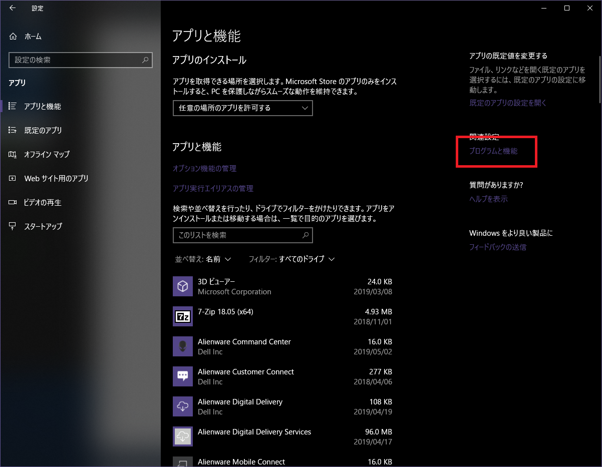
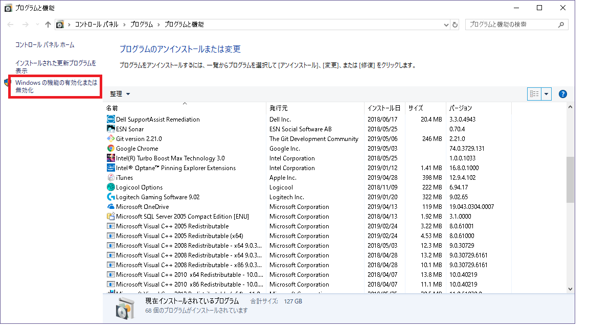
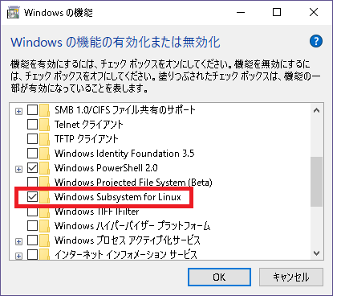

# 事前準備

## Ubuntu on Windows インストール

この演習は、Ubuntu on Windows 環境で実施します。

1. Windows Subsystem for Linux(WSL)を有効化
    1. 「設定」の「アプリ」を開き、『プログラムと機能』をクリックします。
    1. 『Windowsの機能の有効化または無効化』をクリックします。
    1. 「Windows Subsystem for Linux」にチェックを入れ、『OK』を押下します。
1. ストアでUbuntuをインストール
    1. 「ストア」を開き、「Ubuntu」で検索します。
    1. 「Ubuntu　18.04 LTS」を選択して『入手』ボタンを押下し、インストールします。
1. デフォルトユーザーを決定します。
    1. スタートメニュー内に「Ubuntu」が増えていますので、クリックします。
    1. 初回起動時はデフォルトユーザーの設定をします。デフォルトユーザーのIDとパスワードを聞かれますので、指定します。

参考サイト

[Windows10にUbuntuをインストールする方法(Fall Creators Update版)](https://ygkb.jp/7291#toc7)

## インスタンスにJava8、CCMインストール 

### Java8のインストール

この演習は、Java8を用いて行います。Java9以上ですとCassandraが動作しないのでご注意ください。

```aidl
$ sudo apt update
$ sudo apt install openjdk-8-jdk
# インストールが停止する場合は、エンターキーを押してみてください。
$ java -version
openjdk version "1.8.0_181"
OpenJDK Runtime Environment (build 1.8.0_181-b13)
OpenJDK 64-Bit Server VM (build 25.181-b13, mixed mode)
```

### python2, pip のインストール

```aidl
$ sudo apt install python
$ curl "https://bootstrap.pypa.io/get-pip.py" -o "get-pip.py"
$ python get-pip.py --user
# pipへのPATHが通っていない場合、通します。
$ export PATH=$PATH:/home/<user名>/.local/bin
$ pip -V
pip 18.0 from /home/ec2-user/.local/lib/python2.7/site-packages/pip (python 2.7)
```

### CCMのインストール

```aidl
$ pip install ccm --user
$ ccm
Missing arguments
Usage:
  ccm <cluster_cmd> [options]
  ccm <node_name> <node_cmd> [options]
...
```

# 演習1

## Cassandra環境構築

### 1. ノード数3のクラスタ起動用ファイルを作成する（バージョンは2.0.11)
```aidl
$ ccm create -n 3 -v 2.0.11 test
```
### 2. クラスタを起動する
```aidl
$ ccm start
$ ccm status
Cluster: 'test'
---------------
node1: UP
node3: UP
node2: UP

$ ccm node1 nodetool status

Datacenter: datacenter1
=======================
Status=Up/Down
|/ State=Normal/Leaving/Joining/Moving
--  Address    Load       Tokens  Owns (effective)  Host ID                               Rack
UN  127.0.0.1  45.94 KB   1       66.7%             0288df05-191d-435c-afff-44dc0d44db78  rack1
UN  127.0.0.2  46.04 KB   1       66.7%             30c73901-1e7a-498d-8832-f5455b3615e4  rack1
UN  127.0.0.3  46.05 KB   1       66.7%             3148f920-4a4e-4f24-981c-1246c8f721f8  rack1

```

ノードとIPの関係は、下記のようになります。

| name | IP | 
|:-------------|:-------------:|
| node1 | 127.0.0.1 | 
| node2 | 127.0.0.2 |
| node3 | 127.0.0.3 |

## キースペース、テーブル作成

### 1. キースペースとテーブルを作成し、データを投入する。データのトークンを表示する
```aidl
$ ccm node1 cqlsh
CREATE KEYSPACE architecture WITH REPLICATION = 
  {'class':'NetworkTopologyStrategy','datacenter1': 1};
USE architecture; 

CREATE TABLE IF NOT EXISTS user (name TEXT PRIMARY KEY);
 
INSERT INTO user (name) VALUES ('Tony');
INSERT INTO user (name) VALUES ('Steve');
INSERT INTO user (name) VALUES ('Bruce');
INSERT INTO user (name) VALUES ('Thor');
INSERT INTO user (name) VALUES ('Natasha');
INSERT INTO user (name) VALUES ('Clint');

SELECT name, token(name) FROM user;

exit
```

## トークンレンジの確認

### 1. トークンレンジ確認

各ノードの担当トークン範囲を表示する。それと4-1で表示したトークンを付き合わせ、どのデータが
どのノードに格納されているか確認する

```aidl
$ ccm node1 nodetool describering architecture
```

### 2. 1.で割り出した結果が正しいかどうか、下記のコマンドで確認する

```aidl
$ ccm node1 nodetool getendpoints architecture user Tony 
$ ccm node1 nodetool getendpoints architecture user Steve
$ ccm node1 nodetool getendpoints architecture user Bruce 
$ ccm node1 nodetool getendpoints architecture user Thor 
$ ccm node1 nodetool getendpoints architecture user Natasha 
$ ccm node1 nodetool getendpoints architecture user Clint
```

# 演習2

## 1. 食事履歴テーブルを作成

cqlshを使って、architectureキースペースにfood_historyテーブルを作成する

```aidl
$ ccm node1 cqlsh
USE architecture;

CREATE TABLE IF NOT EXISTS food_history (
  uid text,
  date text,
  category text,
  menu text,
  time text,
  PRIMARY KEY (uid, date, category)
);
```

## 2. テストデータ投入

```aidl
INSERT INTO food_history (uid, date, category, menu, time)
  VALUES('shoshii', '20161114', 'dinner', 'Buridaikon Set', '18:06');
INSERT INTO food_history (uid, date, category, menu, time)
  VALUES('shoshii', '20161114', 'lunch', 'Tyuuka Set', '12:35');
INSERT INTO food_history (uid, date, category, menu, time)
  VALUES('shoshii', '20161115', 'lunch', 'Spicy Curry', '13:21');
INSERT INTO food_history (uid, date, category, menu, time)
  VALUES('tyamada', '20161114', 'breakfast', 'Western Set', '08:06');
INSERT INTO food_history (uid, date, category, menu, time)
  VALUES('jsato', '20161114', 'lunch', 'Rahmen', '11:35');
INSERT INTO food_history (uid, date, category, menu, time)
  VALUES('jsato', '20161115', 'lunch', 'Buffe', '11:53');
INSERT INTO food_history (uid, date, category, menu, time)
  VALUES('jsato', '20161116', 'lunch', 'Udon', '11:45');
INSERT INTO food_history (uid, date, category, menu, time)
  VALUES('ssuzu', '20161115', 'lunch', 'Spicy Curry', '12:53');
INSERT INTO food_history (uid, date, category, menu, time)
  VALUES('ssuzu', '20161116', 'lunch', 'Rahmen', '12:45');
INSERT INTO food_history (uid, date, category, menu, time)
  VALUES('ktana', '20161115', 'lunch', 'Japanese Set', '13:13');
INSERT INTO food_history (uid, date, category, menu, time)
  VALUES('ktana', '20161116', 'lunch', 'Soba', '12:15');
INSERT INTO food_history (uid, date, category, menu, time)
  VALUES('awakaba', '20161115', 'lunch', 'Curry', '13:13');
INSERT INTO food_history (uid, date, category, menu, time)
  VALUES('awakaba', '20161116', 'lunch', 'Buta Don', '11:15');

exit
```

## 3. データの内部構造確認

cassandra-cli というツールを使って、データの内部構造を確認し、表形式データとの違いを理解する

```aidl
$ ~/.ccm/test/node1/bin/cassandra-cli
[default@unknown] use architecture;
[default@architecture] list food_history;
[default@architecture] exit;

```

# 演習3

## 1. パーティション定義を誤ったテーブルを構築、データ投入

```aidl
$ ccm node1 cqlsh
USE architecture;

CREATE TABLE IF NOT EXISTS food_history2 (
  uid text,
  date text,
  category text,
  menu text,
  time text,
  PRIMARY KEY (category, uid, date)
);

INSERT INTO food_history2 (uid, date, category, menu, time)
  VALUES('shoshii', '20161114', 'dinner', 'Buridaikon Set', '18:06');
INSERT INTO food_history2 (uid, date, category, menu, time)
  VALUES('shoshii', '20161114', 'lunch', 'Tyuuka Set', '12:35');
INSERT INTO food_history2 (uid, date, category, menu, time)
  VALUES('shoshii', '20161115', 'lunch', 'Spicy Curry', '13:21');
INSERT INTO food_history2 (uid, date, category, menu, time)
  VALUES('tyamada', '20161114', 'breakfast', 'Western Set', '08:06');
INSERT INTO food_history2 (uid, date, category, menu, time)
  VALUES('jsato', '20161114', 'lunch', 'Rahmen', '11:35');
INSERT INTO food_history2 (uid, date, category, menu, time)
  VALUES('jsato', '20161115', 'lunch', 'Buffe', '11:53');
INSERT INTO food_history2 (uid, date, category, menu, time)
  VALUES('jsato', '20161116', 'lunch', 'Udon', '11:45');
INSERT INTO food_history2 (uid, date, category, menu, time)
  VALUES('ssuzu', '20161115', 'lunch', 'Spicy Curry', '12:53');
INSERT INTO food_history2 (uid, date, category, menu, time)
  VALUES('ssuzu', '20161116', 'lunch', 'Rahmen', '12:45');
INSERT INTO food_history2 (uid, date, category, menu, time)
  VALUES('ktana', '20161115', 'lunch', 'Japanese Set', '13:13');
INSERT INTO food_history2 (uid, date, category, menu, time)
  VALUES('ktana', '20161116', 'lunch', 'Soba', '12:15');
INSERT INTO food_history2 (uid, date, category, menu, time)
  VALUES('awakaba', '20161115', 'lunch', 'Curry', '13:13');
INSERT INTO food_history2 (uid, date, category, menu, time)
  VALUES('awakaba', '20161116', 'lunch', 'Buta Don', '11:15');
  
exit;
```

## 2. パーティション定義を誤ったテーブルの内部構造を確認

今後、このテーブルに食事履歴が追加されていった場合、
パーティションがどのように変化するか、演習2との違いに着目し考察してみてください

```aidl
$ ~/.ccm/test/node1/bin/cassandra-cli
[default@unknown] use architecture;
[default@architecture] list food_history2;
[default@architecture] exit;
```

# 演習4

## 1. 複合パーティションキーを使ったテーブルを構築する

```aidl
$ ccm node1 cqlsh
USE architecture;

CREATE TABLE IF NOT EXISTS food_history3 (
  uid text,
  date text,
  category text,
  menu text,
  time text,
  PRIMARY KEY ((uid, date), category)
);

INSERT INTO food_history3 (uid, date, category, menu, time)
  VALUES('shoshii', '20161114', 'dinner', 'Buridaikon Set', '18:06');
INSERT INTO food_history3 (uid, date, category, menu, time)
  VALUES('shoshii', '20161114', 'lunch', 'Tyuuka Set', '12:35');
INSERT INTO food_history3 (uid, date, category, menu, time)
  VALUES('shoshii', '20161115', 'lunch', 'Spicy Curry', '13:21');
INSERT INTO food_history3 (uid, date, category, menu, time)
  VALUES('tyamada', '20161114', 'breakfast', 'Western Set', '08:06');
INSERT INTO food_history3 (uid, date, category, menu, time)
  VALUES('jsato', '20161114', 'lunch', 'Rahmen', '11:35');
INSERT INTO food_history3 (uid, date, category, menu, time)
  VALUES('jsato', '20161115', 'lunch', 'Buffe', '11:53');
INSERT INTO food_history3 (uid, date, category, menu, time)
  VALUES('jsato', '20161116', 'lunch', 'Udon', '11:45');
INSERT INTO food_history3 (uid, date, category, menu, time)
  VALUES('ssuzu', '20161115', 'lunch', 'Spicy Curry', '12:53');
INSERT INTO food_history3 (uid, date, category, menu, time)
  VALUES('ssuzu', '20161116', 'lunch', 'Rahmen', '12:45');
INSERT INTO food_history3 (uid, date, category, menu, time)
  VALUES('ktana', '20161115', 'lunch', 'Japanese Set', '13:13');
INSERT INTO food_history3 (uid, date, category, menu, time)
  VALUES('ktana', '20161116', 'lunch', 'Soba', '12:15');
INSERT INTO food_history3 (uid, date, category, menu, time)
  VALUES('awakaba', '20161115', 'lunch', 'Curry', '13:13');
INSERT INTO food_history3 (uid, date, category, menu, time)
  VALUES('awakaba', '20161116', 'lunch', 'Buta Don', '11:15');
  
exit;
```

## 2. 複合パーティションキーを使ったテーブルの内部構造を確認する

演習2と比べて、パーティションが分割されることを確認する

```aidl
$ ~/.ccm/test/node1/bin/cassandra-cli
[default@unknown] use architecture;
[default@architecture] list food_history3;
[default@architecture] exit;
```

3. 複合パーティションキーを使ったテーブルにクエリを実行する

片方は成功し、片方は失敗するので、その理由を把握しておく

```aidl
$ ccm node1 cqlsh
USE architecture;
SELECT * from food_history3 WHERE uid = 'shoshii' AND date = '20161114';
SELECT * from food_history3 WHERE uid = 'shoshii';
exit;
```

# 演習5

## 1. セカンダリインデックスを用いた検索を行う

インデックス作成前は失敗し、作成後は成功する

```aidl
$ ccm node1 cqlsh
USE architecture;
SELECT * FROM food_history WHERE menu = 'Spicy Curry';
CREATE INDEX ON food_history (menu);
SELECT * FROM food_history WHERE menu = 'Spicy Curry';
```

# 演習6

## 1. テスト用キースペース・テーブル作成

```aidl
$ ccm node1 cqlsh
CREATE KEYSPACE IF NOT EXISTS anti WITH REPLICATION = { 'class' : 'SimpleStrategy', 'replication_factor' : 3 };
USE anti;
CREATE TABLE IF NOT EXISTS test (id text PRIMARY KEY, name text);
ALTER TABLE test WITH compaction = {'class' : 'SizeTieredCompactionStrategy', 'min_threshold':9999, 'max_threshold':9999};
INSERT INTO test ( id, name ) VALUES ( 'abc', 'name1' );

```

## 2. データの書き込みとフラッシュを繰り返す

Ubuntuターミナルをもう一つ立ち上げ、インスタンスにログインして下記を実行

```aidl
$ echo "INSERT INTO anti.test ( id, name ) VALUES ( 'abc', 'name1' );" > insert.cql
$ for i in {1..1000}; do ccm node1 cqlsh -f insert.cql && ccm node1 nodetool flush; done
```

## 3. データの読み取りを繰り返す

別ターミナルをもう一つ立ち上げ、インスタンスにログインして下記を実行

```aidl
$ echo "SELECT * FROM anti.test WHERE id = 'abc';" > select.cql
$ for i in {1..1000}; do ccm node1 cqlsh -f select.cql; done
```

## 4. 読み取り状況を確認する

読み込んだSSTableの数、レイテンシ分布に着目します

```aidl
$ ccm node1 nodetool cfhistograms anti test
```

> ヒストグラムの読み方
> 上のコマンドを打つと、Read処理時の読み取りSSTable数、レイテンシ分布が出ます。下のコメントのように解釈できます。
```aidl

anti/test histograms

SSTables per Read
446 sstables: 35 # 446個のSSTableファイルを読んだリクエストが、35回あったことを示す

Write Latency (microseconds)
149 us: 31
179 us: 25
215 us: 1
258 us: 0
310 us: 0
372 us: 0
446 us: 1

Read Latency (microseconds)
  3311 us: 16 # レイテンシが3311マイクロ秒だったリクエストが、16回あったことを示す
  3973 us: 12
  4768 us: 0
  5722 us: 0
  6866 us: 0
  8239 us: 0
  9887 us: 0
 11864 us: 0
 14237 us: 0
 17084 us: 0
 20501 us: 1
 24601 us: 0
 29521 us: 0
 35425 us: 0
 42510 us: 0
 51012 us: 1
 61214 us: 2
 73457 us: 0
 88148 us: 1
105778 us: 1
126934 us: 0
152321 us: 1

Partition Size (bytes)
72 bytes: 415

Cell Count per Partition
2 cells: 415


```

## 5. データをコンパクションして、再度読み取り状況を確認する

複数のSSTableを一つにまとめます。
まとめた後、再度4.を実行して読み取りSSTableの数、レイテンシ分布に着目します

```aidl
$ ccm node1 nodetool compact
```


