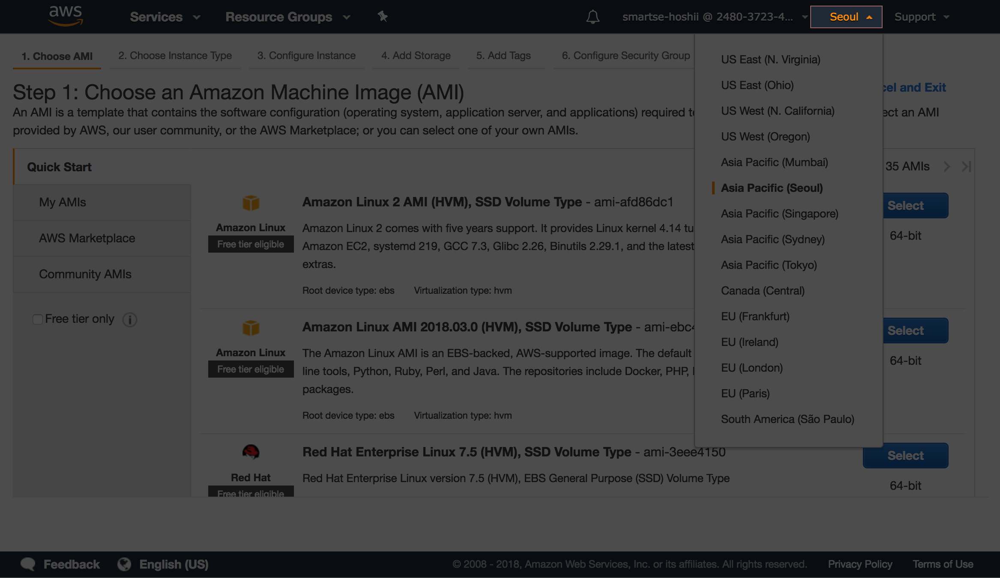
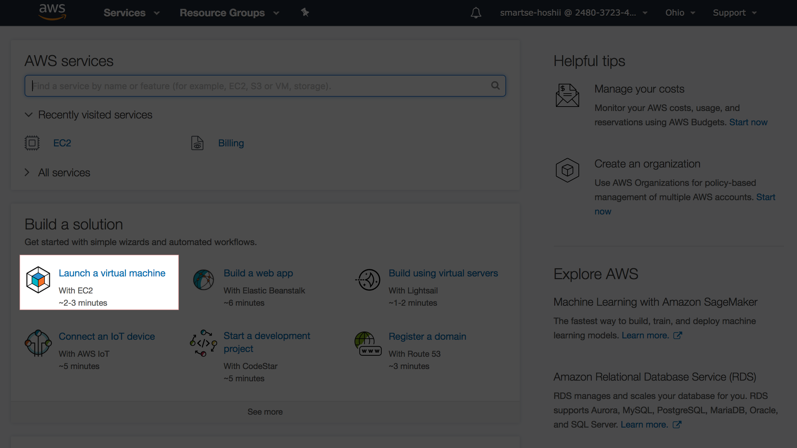
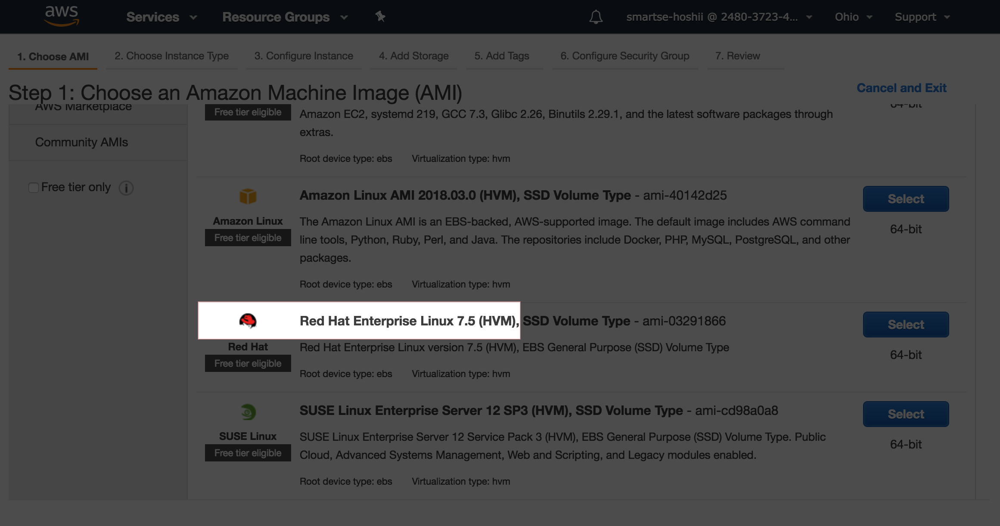
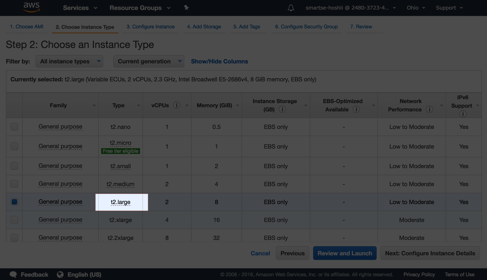
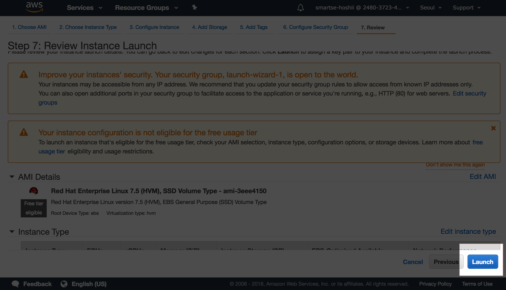
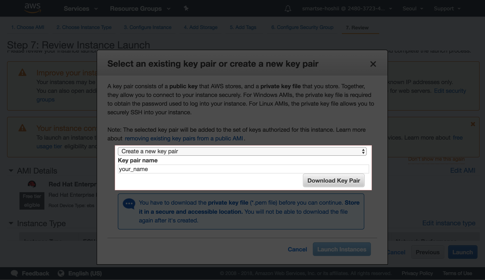
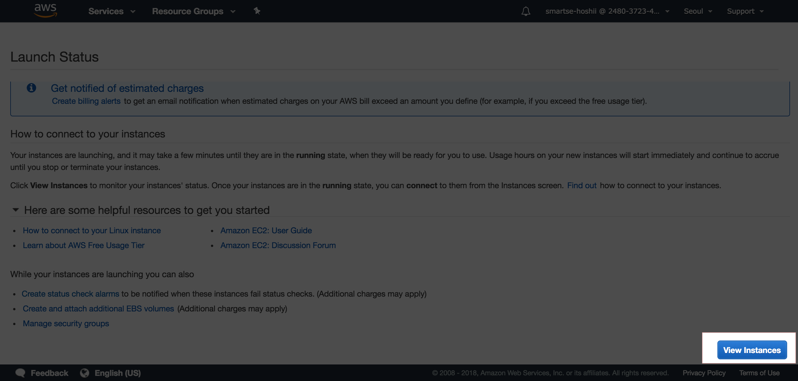
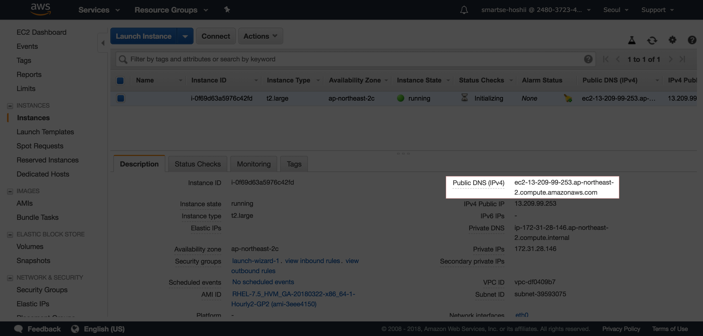

# 演習1
## 1. EC2インスタンス作成

1. AWSに[アクセス](https://248037234963.signin.aws.amazon.com/console)
1. 画面上部のリージョンセレクタで、Asian Pacific(Seoul) を選択する

1. EC2インスタンス作成画面に移動

1. Red Hat Enterprise Linux 7.5 をSELECT

1. インスタンスタイプ `t2.large` にチェックして、 Review and Launch をクリック

1. そのまま Launch をクリック

1. Create a new key pair を選択し、任意のキー名を指定して秘密鍵をダウンロードする

1. Launch Instances をクリック
1. 2~3分待ち、View Instances をクリック

1. stateが running であることを確認して、Public DNS(IPv4)をメモする



## 2. インスタンスにJava8、CCMインストール

1. ターミナルを立ち上げ、上で取得した秘密鍵のパーミションを400にする
```aidl
$ mv ~/Downloads/your_name.pem ./
$ chmod 400 your_name.pem
```
2. 秘密鍵、HostKeyAlgorithms, ec2-userユーザ, 1で作成したインスタンスのpublic dnsを指定してログインする
```aidl
$ ssh -i your_name.pem -oHostKeyAlgorithms=+ssh-dss ec2-user<public_dns>
```
3. Java8のインストール
```aidl
$ sudo yum install -y java
$ java -version
openjdk version "1.8.0_181"
OpenJDK Runtime Environment (build 1.8.0_181-b13)
OpenJDK 64-Bit Server VM (build 25.181-b13, mixed mode)
```
4. pip のインストール
```aidl
$ curl "https://bootstrap.pypa.io/get-pip.py" -o "get-pip.py"
$ python get-pip.py --user
$ pip -V
pip 18.0 from /home/ec2-user/.local/lib/python2.7/site-packages/pip (python 2.7)
```
5. CCMのインストール
```aidl
$ pip install ccm --user
$ ccm
Missing arguments
Usage:
  ccm <cluster_cmd> [options]
  ccm <node_name> <node_cmd> [options]
...
```

## 3. Cassandra環境構築

1. ノード数3のクラスタ起動用ファイルを作成する（バージョンは2.0.11)
```aidl
$ ccm create -n 3 -v 2.0.11 test
```
2. クラスタを起動する
```aidl
$ ccm start
$ ccm status
Cluster: 'test'
---------------
node1: UP
node3: UP
node2: UP

$ ccm node1 nodetool status

Datacenter: datacenter1
=======================
Status=Up/Down
|/ State=Normal/Leaving/Joining/Moving
--  Address    Load       Tokens  Owns (effective)  Host ID                               Rack
UN  127.0.0.1  45.94 KB   1       66.7%             0288df05-191d-435c-afff-44dc0d44db78  rack1
UN  127.0.0.2  46.04 KB   1       66.7%             30c73901-1e7a-498d-8832-f5455b3615e4  rack1
UN  127.0.0.3  46.05 KB   1       66.7%             3148f920-4a4e-4f24-981c-1246c8f721f8  rack1

```

ノードとIPの関係は、下記のようになります。

| name | IP | 
|:-------------|:-------------:|
| node1 | 127.0.0.1 | 
| node2 | 127.0.0.2 |
| node3 | 127.0.0.3 |

## 4. キースペース、テーブル作成

1. キースペースとテーブルを作成し、データを投入する。データのトークンを表示する
```aidl
$ ccm node1 cqlsh
> CREATE KEYSPACE architecture WITH REPLICATION = 
  {'class':'NetworkTopologyStrategy','datacenter1': 1};
> USE architecture; 
> CREATE TABLE user (name TEXT PRIMARY KEY); 
> INSERT INTO user (name) VALUES ('Tony');
  INSERT INTO user (name) VALUES ('Steve');
  INSERT INTO user (name) VALUES ('Bruce');
  INSERT INTO user (name) VALUES ('Thor');
  INSERT INTO user (name) VALUES ('Natasha');
  INSERT INTO user (name) VALUES ('Clint');
> SELECT name, token(name) FROM user;
> exit
```


## 5. トークンレンジの確認

1. トークンレンジ確認

各ノードの担当トークン範囲を表示する。それと4-1で表示したトークンを付き合わせ、どのデータが
どのノードに格納されているか確認する

```aidl
$ ccm node1 nodetool describering architecture
```

2. 1.で割り出した結果が正しいかどうか、下記のコマンドで確認する

```aidl
$ ccm node1 nodetool getendpoints architecture user Tony 
$ ccm node1 nodetool getendpoints architecture user Steve
$ ccm node1 nodetool getendpoints architecture user Bruce 
$ ccm node1 nodetool getendpoints architecture user Thor 
$ ccm node1 nodetool getendpoints architecture user Natasha 
$ ccm node1 nodetool getendpoints architecture user Clint
```

# 演習2

1. 食事履歴テーブルを作成

cqlshを使って、architectureキースペースにfood_historyテーブルを作成する

```aidl
$ ccm node1 cqlsh
> USE architecture;
> CREATE TABLE food_history (
  uid text,
  date text,
  category text,
  menu text,
  time text,
  PRIMARY KEY (uid, date, category)
);
```

2. テストデータ投入

```aidl
> INSERT INTO food_history (uid, date, category, menu, time)
  VALUES('shoshii', '20161114', 'dinner', 'Buridaikon Set', '18:06');
INSERT INTO food_history (uid, date, category, menu, time)
  VALUES('shoshii', '20161114', 'lunch', 'Tyuuka Set', '12:35');
INSERT INTO food_history (uid, date, category, menu, time)
  VALUES('shoshii', '20161115', 'lunch', 'Spicy Curry', '13:21');
INSERT INTO food_history (uid, date, category, menu, time)
  VALUES('tyamada', '20161114', 'breakfast', 'Western Set', '08:06');
INSERT INTO food_history (uid, date, category, menu, time)
  VALUES('jsato', '20161114', 'lunch', 'Rahmen', '11:35');
INSERT INTO food_history (uid, date, category, menu, time)
  VALUES('jsato', '20161115', 'lunch', 'Buffe', '11:53');
INSERT INTO food_history (uid, date, category, menu, time)
  VALUES('jsato', '20161116', 'lunch', 'Udon', '11:45');
INSERT INTO food_history (uid, date, category, menu, time)
  VALUES('ssuzu', '20161115', 'lunch', 'Spicy Curry', '12:53');
INSERT INTO food_history (uid, date, category, menu, time)
  VALUES('ssuzu', '20161116', 'lunch', 'Rahmen', '12:45');
INSERT INTO food_history (uid, date, category, menu, time)
  VALUES('ktana', '20161115', 'lunch', 'Japanese Set', '13:13');
INSERT INTO food_history (uid, date, category, menu, time)
  VALUES('ktana', '20161116', 'lunch', 'Soba', '12:15');
INSERT INTO food_history (uid, date, category, menu, time)
  VALUES('awakaba', '20161115', 'lunch', 'Curry', '13:13');
INSERT INTO food_history (uid, date, category, menu, time)
  VALUES('awakaba', '20161116', 'lunch', 'Buta Don', '11:15');

> exit
```

3. データの内部構造確認

cassandra-cli というツールを使って、データの内部構造を確認し、表形式データとの違いを理解する

```aidl
$ ~/.ccm/test/node1/bin/cassandra-cli
[default@unknown] use architecture;
[default@architecture] list food_history;
[default@architecture] exit;

```

# 演習3

1. パーティション定義を誤ったテーブルを構築、データ投入

```aidl
$ ccm node1 cqlsh
> USE architecture;
> CREATE TABLE food_history2 (
  uid text,
  date text,
  category text,
  menu text,
  time text,
  PRIMARY KEY (category, uid, date)
);
> INSERT INTO food_history2 (uid, date, category, menu, time)
  VALUES('shoshii', '20161114', 'dinner', 'Buridaikon Set', '18:06');
INSERT INTO food_history2 (uid, date, category, menu, time)
  VALUES('shoshii', '20161114', 'lunch', 'Tyuuka Set', '12:35');
INSERT INTO food_history2 (uid, date, category, menu, time)
  VALUES('shoshii', '20161115', 'lunch', 'Spicy Curry', '13:21');
INSERT INTO food_history2 (uid, date, category, menu, time)
  VALUES('tyamada', '20161114', 'breakfast', 'Western Set', '08:06');
INSERT INTO food_history2 (uid, date, category, menu, time)
  VALUES('jsato', '20161114', 'lunch', 'Rahmen', '11:35');
INSERT INTO food_history2 (uid, date, category, menu, time)
  VALUES('jsato', '20161115', 'lunch', 'Buffe', '11:53');
INSERT INTO food_history2 (uid, date, category, menu, time)
  VALUES('jsato', '20161116', 'lunch', 'Udon', '11:45');
INSERT INTO food_history2 (uid, date, category, menu, time)
  VALUES('ssuzu', '20161115', 'lunch', 'Spicy Curry', '12:53');
INSERT INTO food_history2 (uid, date, category, menu, time)
  VALUES('ssuzu', '20161116', 'lunch', 'Rahmen', '12:45');
INSERT INTO food_history2 (uid, date, category, menu, time)
  VALUES('ktana', '20161115', 'lunch', 'Japanese Set', '13:13');
INSERT INTO food_history2 (uid, date, category, menu, time)
  VALUES('ktana', '20161116', 'lunch', 'Soba', '12:15');
INSERT INTO food_history2 (uid, date, category, menu, time)
  VALUES('awakaba', '20161115', 'lunch', 'Curry', '13:13');
INSERT INTO food_history2 (uid, date, category, menu, time)
  VALUES('awakaba', '20161116', 'lunch', 'Buta Don', '11:15');
  
exit;
```

2. パーティション定義を誤ったテーブルの内部構造を確認

今後、このテーブルに食事履歴が追加されていった場合、
パーティションがどのように変化するか、演習2との違いに着目し考察してみてください

```aidl
$ ~/.ccm/test/node1/bin/cassandra-cli
[default@unknown] use architecture;
[default@architecture] list food_history2;
[default@architecture] exit;
```

# 演習4

1. 複合パーティションキーを使ったテーブルを構築する

```aidl
$ ccm node1 cqlsh
> USE architecture;
> CREATE TABLE food_history3 (
  uid text,
  date text,
  category text,
  menu text,
  time text,
  PRIMARY KEY ((uid, date), category)
);
> INSERT INTO food_history3 (uid, date, category, menu, time)
  VALUES('shoshii', '20161114', 'dinner', 'Buridaikon Set', '18:06');
INSERT INTO food_history3 (uid, date, category, menu, time)
  VALUES('shoshii', '20161114', 'lunch', 'Tyuuka Set', '12:35');
INSERT INTO food_history3 (uid, date, category, menu, time)
  VALUES('shoshii', '20161115', 'lunch', 'Spicy Curry', '13:21');
INSERT INTO food_history3 (uid, date, category, menu, time)
  VALUES('tyamada', '20161114', 'breakfast', 'Western Set', '08:06');
INSERT INTO food_history3 (uid, date, category, menu, time)
  VALUES('jsato', '20161114', 'lunch', 'Rahmen', '11:35');
INSERT INTO food_history3 (uid, date, category, menu, time)
  VALUES('jsato', '20161115', 'lunch', 'Buffe', '11:53');
INSERT INTO food_history3 (uid, date, category, menu, time)
  VALUES('jsato', '20161116', 'lunch', 'Udon', '11:45');
INSERT INTO food_history3 (uid, date, category, menu, time)
  VALUES('ssuzu', '20161115', 'lunch', 'Spicy Curry', '12:53');
INSERT INTO food_history3 (uid, date, category, menu, time)
  VALUES('ssuzu', '20161116', 'lunch', 'Rahmen', '12:45');
INSERT INTO food_history3 (uid, date, category, menu, time)
  VALUES('ktana', '20161115', 'lunch', 'Japanese Set', '13:13');
INSERT INTO food_history3 (uid, date, category, menu, time)
  VALUES('ktana', '20161116', 'lunch', 'Soba', '12:15');
INSERT INTO food_history3 (uid, date, category, menu, time)
  VALUES('awakaba', '20161115', 'lunch', 'Curry', '13:13');
INSERT INTO food_history3 (uid, date, category, menu, time)
  VALUES('awakaba', '20161116', 'lunch', 'Buta Don', '11:15');
  
> exit;
```

2. 複合パーティションキーを使ったテーブルの内部構造を確認する

演習2と比べて、パーティションが分割されることを確認する

```aidl
$ ~/.ccm/test/node1/bin/cassandra-cli
[default@unknown] use architecture;
[default@architecture] list food_history3;
[default@architecture] exit;
```

3. 複合パーティションキーを使ったテーブルにクエリを実行する

片方は成功し、片方は失敗するので、その理由を把握しておく

```aidl
$ ccm node1 cqlsh
> USE architecture;
> SELECT * from food_history3 WHERE uid = 'shoshii' AND date = '20161114';
> SELECT * from food_history3 WHERE uid = 'shoshii';
> exit;
```

# 演習5

1. セカンダリインデックスを用いた検索を行う

インデックス作成前は失敗し、作成後は成功する

```aidl
$ ccm node1 cqlsh
> USE architecture;
> SELECT * FROM food_history WHERE menu = 'Spicy Curry';
> CREATE INDEX ON food_history (menu);
> SELECT * FROM food_history WHERE menu = 'Spicy Curry';
```

# 宿題

1. NoSQLが登場した背景を、簡潔に論述してください 
1. NoSQL利用が適さないユースケースを１つ例示し、その理由を簡潔に論述してください
1. Cassandraのパーティションキー設定にあたっての注意点を論述してください
1. Cassandraのクエリ設計をする際の注意点を簡潔に論述してください